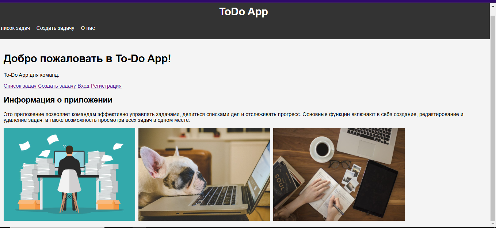
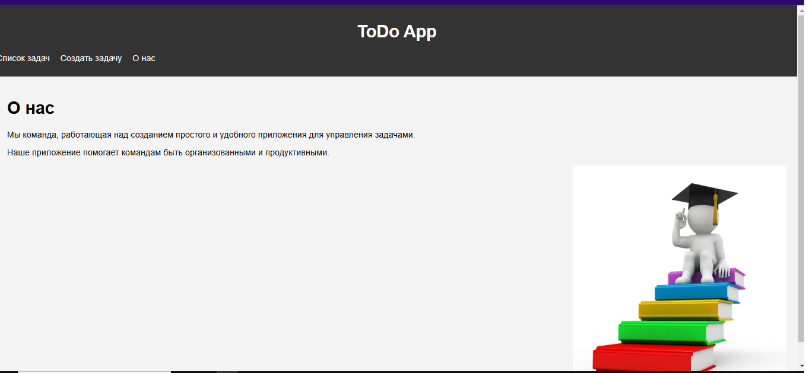
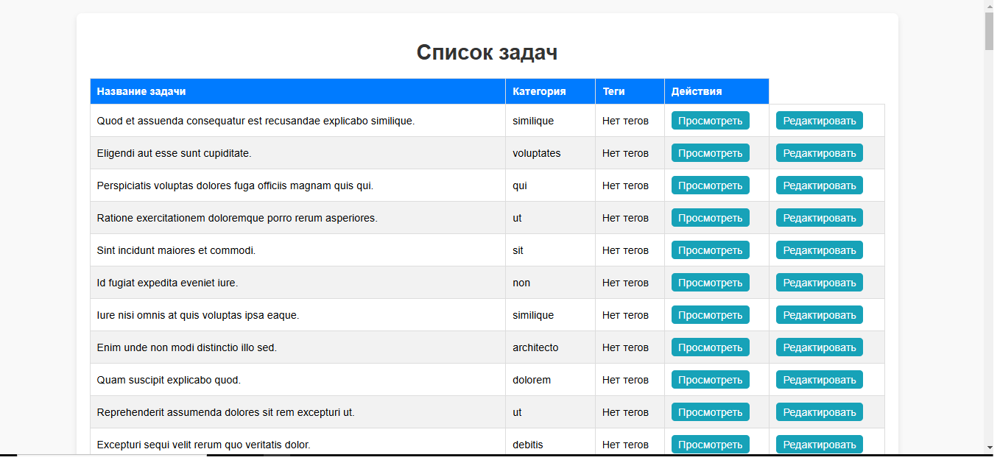
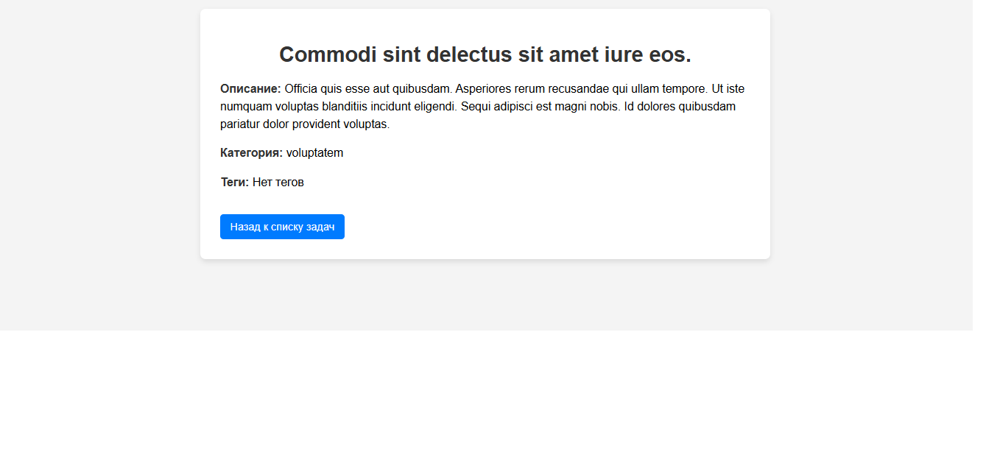
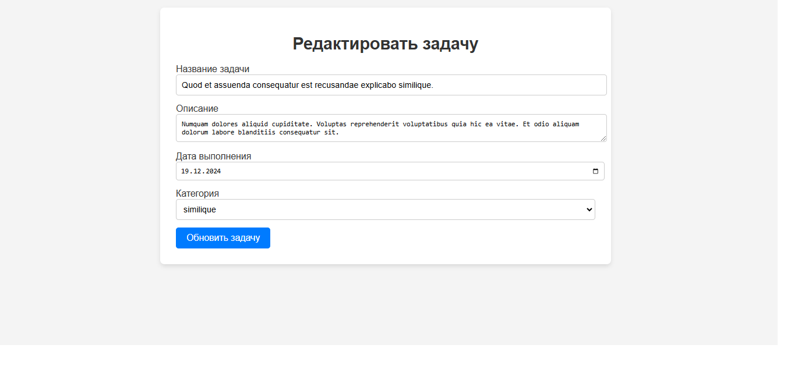
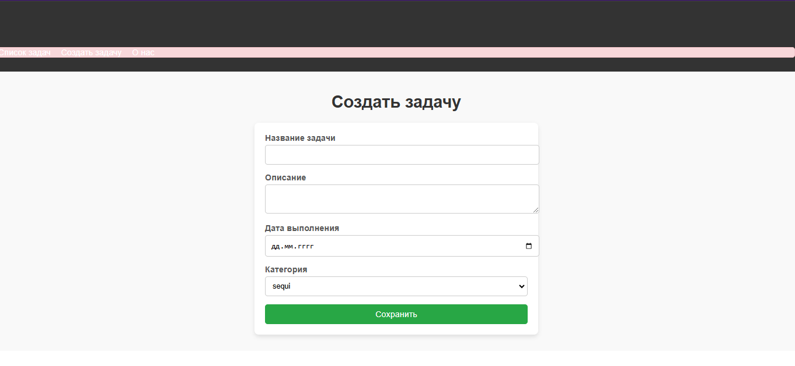
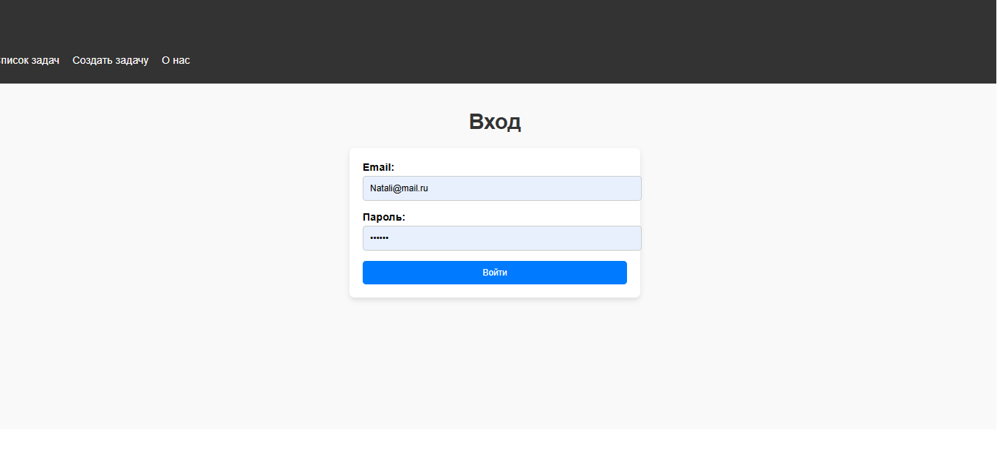
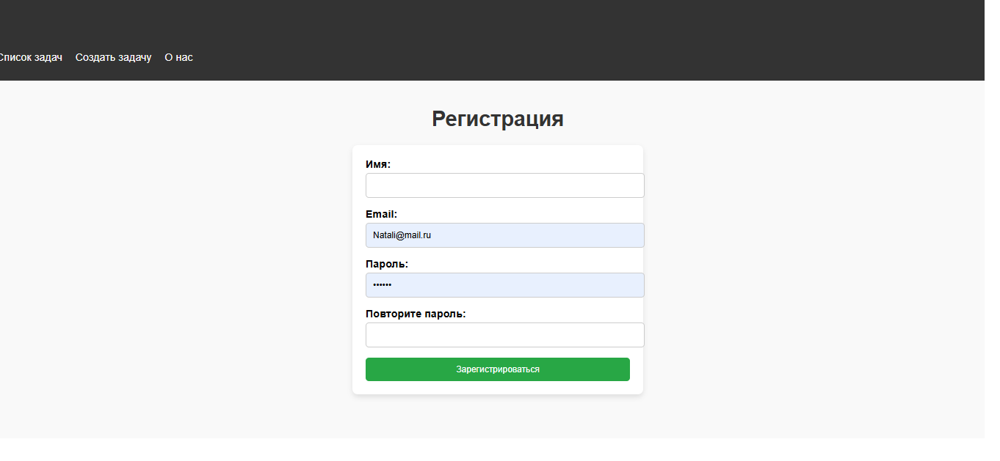

# Индивидуальная работа 

## Цель работы

Мой проект представляет собой веб-приложение для управления задачами и профилем пользователя, с возможностью различных уровней доступа. Приложение предназначено для того, чтобы пользователи могли эффективно организовывать свою работу, управлять своими задачами и просматривать/редактировать личную информацию. 

## Основные функции

1. Авторизация и регистрация: Пользователи могут зарегистрироваться в системе и авторизоваться, чтобы получить доступ к своему личному кабинету. Вход и регистрация защищены стандартными мерами безопасности, такими как хэширование паролей и подтверждение email-адресов.
2. Личный кабинет пользователя: После авторизации каждый пользователь попадает в свой личный кабинет, где он может просматривать свою личную информацию.
3. Управление задачами: Пользователи могут создавать, редактировать, удалять и просматривать задачи. Каждая задача имеет название, описание, дату выполнения и категорию. Задачи могут быть связаны с тегами для упрощения поиска и фильтрации.
4. Уведомления: В приложении используются уведомления для информирования пользователей о различных действиях, таких как успешный вход, изменения в профиле, создание или редактирование задач.
5. Безопасность: Все данные пользователей защищены стандартными средствами безопасности, включая защиту от CSRF-атак, хэширование паролей и управление сессиями.
6. 

## Инструкции по установке и запуску проекта

1. Сначала клонируйте репозиторий с  проектом с GitHub.
- `git clone https://github.com/Kristinajfnb/individual.git`
2. Убедитесь, что у вас установлен PHP, Composer, и Node.js.
3. Установите PHP зависимости.
- `composer install`
4. Откройте файл .env и настройте параметры подключения к базе данных.
- `DB_CONNECTION=sqlite DB_DATABASE=/path_to_your_database/database.sqlite`
5. Запустите миграций базы данных.
- `php artisan migrate`
6. Запуск сеедеров.
- `php artisan db:seed`
7. Запуск приложения
- `php artisan serve`

## Примеры использования проекта

1. Главная страница, знакомство с приложением.


2. Просмотр текущих задач. На странице Просмотра задачи вы можете увидеть подробную информацию о задаче, включая описание, категорию и теги, если они были добавлены.
```php
<!-- resources/views/tasks/show.blade.php -->

@extends('layouts.app')

@section('content')
    <div class="container">
        <h1>{{ $task->title }}</h1>
        <p><strong>Описание:</strong> {{ $task->description }}</p>
        <p><strong>Категория:</strong> {{ $task->category->name ?? 'Нет категории' }}</p>
        <p><strong>Теги:</strong>
            @if($task->tags->isEmpty())
                Нет тегов
            @else
                <ul>
                    @foreach($task->tags as $tag)
                        <li>{{ $tag->name }}</li>
                    @endforeach
                </ul>
            @endif
        </p>
        <a href="{{ route('tasks.index') }}" class="btn btn-primary">Назад к списку задач</a>
    </div>
@endsection
```


3. Редактирование задачи. Страница Редактирования задачи позволяет изменить уже существующую задачу. Вы можете изменить название, описание, срок выполнения и категорию.

4. Создание задачи, страница Создание задачи позволяет пользователям добавлять новые задачи. В ней можно указать название, описание, срок выполнения и категорию задачи.

5. Вход, личный кабинет.


6. Регистрация пользователя.


## Список использованных источников

1. [Документация Laravel](https://laravel.com/docs) - Официальная документация Laravel для разработки приложений.
2. [PHP Manual](https://www.php.net/manual/ru/) - Официальная документация PHP, включая функции и синтаксис.
3. [Bootstrap Documentation](https://getbootstrap.com/docs/5.0/getting-started/introduction/) - Документация Bootstrap для стилизации интерфейсов.
4. [GitHub Pages](https://pages.github.com/) - Документация для размещения статических сайтов на GitHub.
5. [MDN Web Docs](https://developer.mozilla.org/en-US/) - Документация по HTML, CSS и JavaScript.